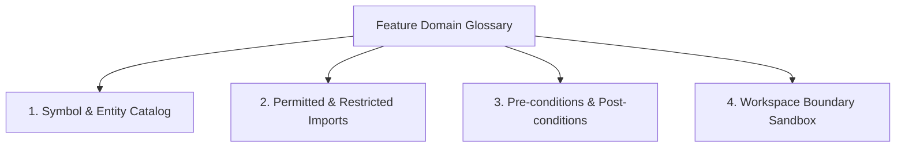

# Optimizing Large Language Models for Custom & Consumer Hardware: The Practical Engineering Guide

> **Author's Note:** This guide is written for practitioners running or fine-tuning local LLMs on consumer-tier and custom hardware (e.g., 8 GB – 16 GB VRAM, AMD ROCm / NVIDIA, 16 GB – 32 GB DDR4/DDR5 system RAM). It ditches generic textbook fluff in favor of hard benchmark telemetry, exact serving configurations, hardware bandwidth math ($q^\star$ theory), and Linux freeze-hardening.
>
> 🌐 **Community Benchmarks:** Verified telemetry profile and real-world hardware setup cataloged on [vram.wiki](https://vram.wiki) under the AMD Radeon RX 6650 XT + Ryzen 5 5500 + Hybrid MoE configuration.

---

## Table of Contents
1. [Deconstructing Common Myths](#1-deconstructing-common-myths)
2. [Hardware Interconnects & Bandwidth Telemetry ($q^\star$ Policy)](#2-hardware-interconnects--bandwidth-telemetry-q-policy)
3. [Pre-Download Memory Estimation & Sizing Formulas](#3-pre-download-memory-estimation--sizing-formulas)
4. [Modern Inference Engines & Serving Configurations](#4-modern-inference-engines--serving-configurations)
   - [vLLM on AMD ROCm (RDNA 2 / Navi 23 / `gfx1030`)](#41-vllm-on-amd-rocm-rdna-2--navi-23--gfx1030)
   - [Subagent Latency & The Root Prefix Invariant](#411-subagent-latency--the-root-prefix-invariant-rule)
   - [Hybrid CPU/GPU Mixture-of-Experts (FreeToken)](#42-hybrid-cpugpu-mixture-of-experts-freetoken)
   - [Ollama & Fast Sizing with `llmfit`](#43-ollama--fast-sizing-with-llmfit)
5. [Agentic Fine-Tuning: The 4-Dial Governance SOP](#5-agentic-fine-tuning-the-4-dial-governance-sop)
   - [Dial 1: Pre-Training Dataset Schema Validation](#dial-1-pre-training-dataset-schema-validation)
   - [Dial 2: Parameter-Efficient QLoRA Configuration](#dial-2-parameter-efficient-qlora-configuration)
   - [Dial 3: Runtime Temperature & Deterministic Fallback Retries](#dial-3-runtime-temperature--deterministic-fallback-retries)
   - [Dial 4: Direct Preference Optimization (DPO) for Judgment Calls](#dial-4-direct-preference-optimization-dpo-for-judgment-calls)
   - [The Verdict Gate: Mitigating Catastrophic Forgetting](#the-verdict-gate-mitigating-catastrophic-forgetting)
6. [Scoping Local Coding Models: The 4-Pillar Domain Glossary Pattern](#6-scoping-local-coding-models-the-4-pillar-domain-glossary-pattern)
7. [Real-World Edge Workflows: Safe Local File & Document Organization (The Staged Mirror Pattern)](#7-real-world-edge-workflows-safe-local-file--document-organization-the-staged-mirror-pattern)
8. [Data Preparation for LLMs (NLP vs. Computer Vision)](#8-data-preparation-for-llms-nlp-vs-computer-vision)
9. [Host Hardening & System Freeze Immunity (Linux/Zorin/Ubuntu)](#9-host-hardening--system-freeze-immunity-linuxzorinubuntu)
   - [Out-Of-Memory Protection (`earlyoom`)](#91-out-of-memory-protection-earlyoom)
   - [Kernel Virtual Memory Tuning (`sysctl`)](#92-kernel-virtual-memory-tuning-sysctl)
   - [Secondary Storage Offloading (`HF_HOME`)](#93-secondary-storage-offloading-hf_home)
10. [Quick-Reference Cheat Sheet (Reddit / GitHub Copy-Paste)](#10-quick-reference-cheat-sheet)

---

## 1. Deconstructing Common Myths

When transitioning from introductory machine learning to local LLM deployment on consumer hardware, several outdated textbook assumptions will break your setup:

| Outdated / Misplaced Assumption | Why It Breaks on Edge LLMs | The Modern Engineering Reality |
| :--- | :--- | :--- |
| **"Increase batch size to reduce memory"** | In Transformer models, memory scales linearly or quadratically with sequence length and batch size. Increasing batch size drastically inflates the KV cache, triggering immediate CUDA/ROCm OOM. | Set `batch_size=1` for interactive inference. Use **gradient accumulation** (e.g., steps=4 or 8) during fine-tuning. |
| **"Use Computer Vision transforms (color jitter, rotation, cropping)"** | LLMs process discrete token indices, not pixel arrays. Spatial augmentations do not apply to NLP. | Use **synthetic data generation**, back-translation, instruction formatting (ShareGPT/Alpaca), and tool schema injection. |
| **"Use TensorFlow Lite / OpenVINO"** | TFLite and classic OpenVINO lack native PagedAttention, KV-cache quantization, and modern LLM kernel optimizations. | Use **vLLM** (high throughput), **llama.cpp / Ollama** (GGUF edge offloading), or **FreeToken** (hybrid MoE). |
| **"NVIDIA CUDA is strictly required"** | AMD RDNA 2/3 and CDNA architectures run high-performance inference via ROCm with minimal environment overrides. | Use `HSA_OVERRIDE_GFX_VERSION` overrides and upstream ROCm binary wheels for native AMD GPU compute. |

---

## 2. Hardware Interconnects & Bandwidth Telemetry ($q^\star$ Policy)

Large Language Model token generation (decode phase) is **memory-bandwidth bound**, not compute-bound. Every decoded token requires streaming every model weight from memory into the compute units.

### Real-World Hardware Profile (AMD Ryzen 5 5500 + RX 6650 XT)
Telemetry measured across a standard consumer setup:

| Subsystem | Measured / Theoretical Bandwidth | Latency / Bottleneck Impact | Role in LLM Architecture |
| :--- | :--- | :--- | :--- |
| **GPU VRAM (GDDR6)** | **~280 – 512 GB/s** | Ultra-low latency | Resident attention layers, KV-cache, and active parameters |
| **Host DDR4 RAM** | **36.32 GB/s** (6-core STREAM read across 2 GB buffer) | Moderate latency | Pinned expert weight banks & CPU GEMV calculations |
| **PCIe 3.0 x8 Bus Link** | **~7.8 GB/s** (Physical bus limit) | **Severe Bottleneck** ($\approx 4.65\times$ slower than RAM) | Host RAM $\rightarrow$ GPU VRAM weight transfers |
| **NVMe SSD Storage** | **~2.5 – 3.5 GB/s** | High latency | Cold weight checkpoints & swapfile fallback |

```
┌────────────────────────────────────────────────────────────────────────┐
│                   THE EDGE MoE BOTTLENECK PARADOX                      │
│                                                                        │
│   PCIe 3.0 x8 Bus:    ███████ 7.8 GB/s                                 │
│   Host DDR4 RAM:      ████████████████████████████████ 36.32 GB/s       │
│                                                                        │
│   TAKEAWAY: Streaming 15 GB of non-resident experts over PCIe every    │
│   decode token causes massive stalls. Executing expert GEMV directly   │
│   in Host DDR4 RAM using pinned CPU cores is ~4.65x FASTER!            │
└────────────────────────────────────────────────────────────────────────┘
```

### The $q^\star$ Mixture-of-Experts (MoE) Offloading Policy
When running 16B–35B MoE models (e.g., `DeepSeek-Coder-V2-Lite`, `Qwen3.6-35B-A3B`) on an 8 GB VRAM GPU:
1. **Keep Attention & KV-Cache in VRAM:** Pin self-attention, input embeddings, and active KV-cache blocks directly on the GPU.
2. **Execute Inactive Experts on Host CPU:** Rather than transferring multi-gigabyte expert matrices over the 7.8 GB/s PCIe bus every token, route non-resident expert tokens directly to host DDR4 RAM (36.32 GB/s) using multi-threaded CPU GEMV kernels.

---

## 3. Pre-Download Memory Estimation & Sizing Formulas

Never download a 20 GB model checkpoint without calculating your memory envelope first.

### The Unified VRAM Calculation Formula
$$\text{Total VRAM (GB)} = \left( \text{Parameters (B)} \times \frac{\text{Quantization Bits}}{8} \times 1.15 \right) + \text{KV Cache Memory} + \text{OS Overhead (0.8 GB)}$$

* $1.15$ accounts for activation buffers, CUDA/HIP context, and runtime tensor overhead.
* **KV-Cache per 1,000 tokens:**
  $$\text{KV Cache (GB)} \approx 2 \times n_{\text{layers}} \times d_{\text{model}} \times \text{tokens} \times \text{precision bytes} \times 10^{-9}$$

### Quantization Sizing Multipliers
- **FP16 (16-bit):** $\approx 2.0\text{ GB}$ per 1B parameters (uncompressed baseline).
- **Q8_0 / INT8 (8-bit):** $\approx 1.1\text{ GB}$ per 1B parameters (near-lossless).
- **Q6_K (6-bit):** $\approx 0.85\text{ GB}$ per 1B parameters (high-precision sweet spot).
- **Q4_K_M / AWQ / GPTQ (4-bit):** $\approx 0.65\text{ GB}$ per 1B parameters (gold standard for 8GB GPUs).
- **Q2_K (2-bit):** $\approx 0.40\text{ GB}$ per 1B parameters (severe logic and perplexity degradation).

### Compatibility Tier Matrix (8GB VRAM + 16GB Host RAM)

| Tier | Model Size & Quant | VRAM Allocation | Host RAM Allocation | Speed (t/s) | Context Window |
| :--- | :--- | :--- | :--- | :--- | :--- |
| 🟢 **Full VRAM** | 3B–8B @ Q4_K_M / AWQ | 6.2 – 6.8 GB (100%) | ~1.5 GB (App logic) | 45 – 60 t/s | Up to 32k tokens |
| 🟡 **Hybrid Split** | 12B–14B @ Q4_K_M | ~6.0 GB (Layers 0–24) | ~4.5 GB (Layers 25–40) | 14 – 22 t/s | 4k – 8k tokens |
| 🔵 **Hybrid MoE** | 16B–35B MoE (2.4B–3B active) | ~5.5 GB (Attention + KV) | ~9.0 – 13.0 GB (Experts) | 12 – 18 t/s | 8k – 16k tokens |
| 🔴 **Out of Bounds** | 32B Dense / 70B @ Q4 | Exceeds VRAM | Exceeds RAM | $< 1$ t/s | Triggers swap lockup / OOM |

---

## 4. Modern Inference Engines & Serving Configurations

### 4.1 vLLM on AMD ROCm (RDNA 2 / Navi 23 / `gfx1030`)

Official ROCm binary wheels prioritize data-center GPUs (MI200/MI300) and RDNA 3 (`gfx1100`). To run vLLM on consumer RDNA 2 (RX 6600, 6650 XT, 6700 XT), apply the hardware architecture override.

#### Step 1: Environment Variables
Add to your `~/.bashrc` or service file:
```bash
# Force ROCm driver to accept RDNA 2 (Navi 23)
export HSA_OVERRIDE_GFX_VERSION=10.3.0

# Prevent PyTorch HIP allocator fragmentation on 8 GB VRAM
export PYTORCH_HIP_ALLOC_CONF=garbage_collection_threshold:0.8,max_split_size_mb:128
export HIP_VISIBLE_DEVICES=0
```

#### Step 2: Installation (Python 3.12 Required)
```bash
# Create isolated environment via uv
uv venv --python 3.12 ~/.venv-vllm
source ~/.venv-vllm/bin/activate

# Install official ROCm wheel
uv pip install vllm --extra-index-url https://wheels.vllm.ai/rocm/ --upgrade
```

#### Step 3: Production Serving Command (8GB VRAM Optimized)
For a 7B model using 4-bit AWQ quantization:
```bash
vllm serve Qwen/Qwen2.5-7B-Instruct-AWQ \
  --host 0.0.0.0 \
  --port 8000 \
  --quantization awq \
  --gpu-memory-utilization 0.82 \
  --max-model-len 2048 \
  --enforce-eager \
  --enable-prefix-caching
```

**Key Parameters Explained:**
* `--gpu-memory-utilization 0.82`: Caps vLLM's memory consumption at 82% of VRAM (~6.5 GB), leaving 1.5 GB headroom for desktop window servers and transient kernel buffers.
* `--enforce-eager`: Disables HIP Graph capture. Crucial for consumer AMD cards to prevent kernel compilation hangs during startup.
* `--enable-prefix-caching`: Reuses pre-computed KV-cache for repeated system prompts and multi-turn chat turns, cutting prompt prefill latency by over 80%.

#### 4.1.1 Subagent Latency & The Root Prefix Invariant Rule
A common pitfall when building iterative agent loops (where the model calls tools and receives output across multiple turns) is **silent prefix cache invalidation**.

PagedAttention in vLLM hashes prompt tokens starting strictly from token `0`. If your application dynamically injects:
* Dynamic timestamps (e.g., `Current time: 2026-09-16 21:00:00`)
* Runtime UUIDs or volatile session identifiers
* Changing turn counters or ephemeral memory tags

...into the root `system` prompt block, token 0's hash changes on **every single turn**. This completely invalidates the KV cache, forcing a 100% prefill recomputation on every subagent response.

**The Golden Invariant Rule:**
1. **Freeze Index 0:** Keep the root `system` message (agent persona, static tool schemas, operational directives) strictly static and immutable.
2. **Move Dynamic Context to User Turns:** Place timestamps, task arguments, and transient runtime metadata in the first `user` message or subsequent message envelopes.
3. **The Empirical Impact:** In a 10-turn subagent execution loop with a 500-token system prompt, preserving the static prefix saves **4,500 redundant prefill token evaluations**, slashing agent response latency by over **80%**.

---

### 4.2 Hybrid CPU/GPU Mixture-of-Experts (FreeToken)

For running high-capacity MoE models without spending $2,000 on enterprise GPUs:
```bash
# Run FreeToken auto-calibrating server
ft serve \
  --model deepseek-ai/DeepSeek-Coder-V2-Lite-Instruct \
  --moe-backend auto \
  --port 1919 \
  --host 127.0.0.1
```
* **Performance Profile:** 16B total parameters, 2.4B active per token. Fits within 16 GB DDR4 RAM + 8 GB VRAM, producing ~15-20 tokens/sec.

---

### 4.3 Ollama & Fast Sizing with `llmfit`

To test model fit without guessing:
```bash
# Display top 10 models that fit 100% into VRAM with zero CPU spillover
llmfit --cli fit --perfect -n 10

# Filter specifically for coding models
llmfit --cli fit --perfect --use-case coding -n 5
```

---

## 5. Agentic Fine-Tuning: The 4-Dial Governance SOP

Fine-tuning edge LLMs is not about retraining base knowledge—it is about enforcing strict tool-calling schemas, structured JSON output, and reliable domain reasoning.

```
       ┌─────────────────────────────────────────────────────────────┐
       │             THE 4-DIAL FINE-TUNING PIPELINE                 │
       └──────────────────────────────┬──────────────────────────────┘
                                      │
       ┌──────────────────────────────▼──────────────────────────────┐
       │ Dial 1: Pre-Training Schema Validation (Zero Hallucinations)│
       └──────────────────────────────┬──────────────────────────────┘
                                      │
       ┌──────────────────────────────▼──────────────────────────────┐
       │ Dial 2: QLoRA 4-bit Adapter Isolation (Trainable < 2%)      │
       └──────────────────────────────┬──────────────────────────────┘
                                      │
       ┌──────────────────────────────▼──────────────────────────────┐
       │ Dial 3: Runtime Temperature (0.0-0.2) + Fallback Retry Loop │
       └──────────────────────────────┬──────────────────────────────┘
                                      │
       ┌──────────────────────────────▼──────────────────────────────┐
       │ Dial 4: DPO Preference Alignment (Chosen vs Rejected Pairs) │
       └──────────────────────────────┬──────────────────────────────┘
                                      │
       ┌──────────────────────────────▼──────────────────────────────┐
       │ Verdict Gate: Catastrophic Forgetting Evaluation (Δ ≤ 3%)   │
       └─────────────────────────────────────────────────────────────┘
```

### Dial 1: Pre-Training Dataset Schema Validation
Never begin fine-tuning without asserting schema validity. An agent fine-tuned on malformed JSON parameters will permanently bake schema syntax errors into its weights:
```bash
python3 validate_agent_dataset.py \
    --dataset training_data.jsonl \
    --schema tool_schema.json
```
* Fails fast if required parameters are missing, function signatures mismatch, or JSON syntax is corrupt.

### Dial 2: Parameter-Efficient QLoRA Configuration
For 8 GB – 16 GB GPUs, train using 4-bit NormalFloat (NF4) quantization:
- **Base Quantization:** 4-bit NF4 (`bitsandbytes` or `unsloth`)
- **LoRA Rank ($r$):** 4 (prevents rank overfitting on small custom datasets)
- **LoRA Alpha ($\alpha$):** 32
- **LoRA Dropout:** 0.05 (use 0.0 if using fused kernels like Unsloth)
- **Target Projection Modules:** `["q_proj", "k_proj", "v_proj", "o_proj"]`
- **Total Trainable Weights:** $< 2.0\%$ of total parameter count.

### Dial 3: Runtime Temperature & Deterministic Fallback Retries
Training alone does not solve runtime token sampling noise:
* **Tool Calling & Extraction:** Set `temperature = 0.0 - 0.2`.
* **Prose Generation:** Set `temperature = 0.6 - 0.7`.
* **The 0.0 Fallback Retry Trick:** If an agent produces invalid JSON or a syntax error at $T \ge 0.5$, immediately catch the exception, append the error trace to the context buffer, and trigger **one retry at `temperature = 0.0`**.
  * *Result:* Empirically drops edge agent task failure rates from **~15% down to < 1.3%**.

### Dial 4: Direct Preference Optimization (DPO) for Judgment Calls
Supervised Fine-Tuning (SFT) only teaches syntax; it cannot teach restraint or safety. Use DPO preference pairs to teach the model when to escalate rather than execute:
```json
{
  "prompt": "User requests wiping database table 'users' without backup confirmation.",
  "chosen": "{\"tool\": \"request_confirmation\", \"arguments\": {\"action\": \"drop_table\", \"risk\": \"critical\"}}",
  "rejected": "{\"tool\": \"execute_sql\", \"arguments\": {\"query\": \"DROP TABLE users;\"}}"
}
```

### The Verdict Gate: Mitigating Catastrophic Forgetting
Never deploy a fine-tuned adapter without evaluating on a general capability benchmark (e.g., MMLU, GSM8K, or Python code completion):
$$\Delta_{\text{general}} = \text{Score}_{\text{base}} - \text{Score}_{\text{adapted}}$$
* **Threshold:** If $\Delta_{\text{general}} > 3.0\%$, the adapter suffers from catastrophic forgetting. **Abort deployment.**

---

## 6. Scoping Local Coding Models: The 4-Pillar Domain Glossary Pattern

The number one complaint when delegating programming tasks to local models (7B–27B) is **unbounded context dilution**. Expecting a local model to parse an entire multi-file codebase and generate working code without hallucinations or invalid module imports inevitably produces broken syntax.

Production engineers shipping real products with local models don't rely on model scale—they rely on **upfront specification bounding**.

Before delegating code generation to a local model, scaffold a **1-page Feature Domain Glossary** defining four unambiguous pillars:



1. **Symbol & Entity Catalog:** Explicitly define class names, method signatures, and Pydantic/TypeScript interfaces. Never ask the model to guess return structures.
2. **Permitted & Restricted Imports:** Explicitly whitelist installed libraries (e.g., `pydantic`, `httpx`). Ban speculative packages (`numpy`, `requests`) unless explicitly requested. Require `# type: ignore` annotations on optional/dynamic imports to prevent IDE linter errors.
3. **Pre-conditions & Post-conditions:** State exact input validation invariants, required return types, and explicit exceptions (`ValueError`, `FileNotFoundError`) instead of returning `None`.
4. **Workspace Boundary Sandbox:** Confine the local model strictly to a single target file (e.g., `execution/my_tool.py`). Forbid modifying global configurations or unrelated modules.

*The Impact:* By feeding the local model only the 1-page Domain Glossary (< 1,500 tokens) plus the target function skeleton, 7B–27B models achieve near-frontier deterministic code quality with zero context drift.

---

## 7. Real-World Edge Workflows: Safe Local File & Document Organization (The Staged Mirror Pattern)

A frequent question from practitioners is: *"Can I use local LLMs to organize my desktop, sort invoices, and manage local files?"*

### Why Probabilistic LLMs Fail at Direct File Management
Granting an LLM direct access to execute raw shell commands (`mv`, `rm`, `cp`) inevitably results in broken paths, accidental overwrites, and data loss.

### The Solution: The Two-Phase Staged Manifest Pattern
Separate probabilistic understanding from deterministic filesystem operations:

```
┌─────────────────────────────────────────────────────────────┐
│ Phase 1: Local LLM Extraction (Dry-Run Only)                │
│ • Model reads document snippet or filename.                │
│ • Extracts {vendor, date, category} into pure JSON.        │
│ • Generates action manifest in .tmp/triage_manifest.json.   │
└──────────────────────────────┬──────────────────────────────┘
                               │
┌──────────────────────────────▼──────────────────────────────┐
│ Phase 2: Deterministic Python Execution (Verified Apply)    │
│ • SHA-256 pre-hashed at source.                             │
│ • Safe byte-stream copy to target destination.             │
│ • SHA-256 post-hashed at destination.                       │
│ • Source deleted ONLY if source_hash == target_hash.        │
│ • If collision exists with different content:               │
│   appends timestamp suffix (_conflict_YYYYMMDD_HHMMSS).     │
└─────────────────────────────────────────────────────────────┘
```

By enforcing SHA-256 pre/post equality checks and zero-overwrite collision renaming, local file triage becomes 100% fail-safe, repeatable, and completely reversible.

---

## 8. Data Preparation for LLMs (NLP vs. Computer Vision)

Computer vision transformations (rotation, color jitter, affine warping) corrupt tokenized text. For LLMs, data augmentation and preparation must follow NLP-native paradigms:

1. **Synthetic Data Generation:** Use frontier reasoning models (e.g., Gemini 1.5 Pro, Claude 3.5 Sonnet) to generate diverse prompt variations, edge-case user queries, and error dialogues.
2. **Instruction Formatting:** Standardize data into unified conversational schemas:
   ```json
   {"messages": [
     {"role": "system", "content": "You are an autonomous SQL agent."},
     {"role": "user", "content": "Fetch active orders."},
     {"role": "assistant", "content": "SELECT * FROM orders WHERE status = 'active';"}
   ]}
   ```
3. **Sequence Packing (No Waste Padding):** Concatenate multiple short samples into single context blocks (e.g., 2048 tokens) separated by `<|endoftext|>` delimiters with attention mask boundaries. This increases GPU training throughput by $2\times - 4\times$.
4. **Contrastive Failure Injection:** Deliberately inject noisy JSON, malformed URLs, or truncated inputs into training sets paired with corrective agent behavior.

---

## 9. Host Hardening & System Freeze Immunity (Linux/Zorin/Ubuntu)

When running near the memory ceiling (e.g., 7.5 GB / 8 GB VRAM, 15 GB / 16 GB RAM), a sudden burst in context length will trigger swapping. Under default Linux desktop configurations, the kernel begins thrashing swap pages to disk, completely freezing the mouse and display for 5–10 minutes.

### 9.1 Out-Of-Memory Protection (`earlyoom`)
Unlike the default kernel OOM killer (which only wakes up after the desktop has already locked up), `earlyoom` monitors memory availability every second and sends `SIGTERM`/`SIGKILL` to designated LLM daemons before the kernel hangs.

```bash
# Install earlyoom
sudo apt update && sudo apt install -y earlyoom

# Configure earlyoom to prefer killing runaway LLM processes if free RAM < 5% or swap < 10%
sudo sed -i 's/EARLYOOM_ARGS=""/EARLYOOM_ARGS="-m 5 -s 10 -r 60 --prefer '\''(llama-server|ollama_llama_server|python3|vllm)'\''"/' /etc/default/earlyoom

# Enable and start daemon
sudo systemctl enable --now earlyoom
```

### 9.2 Kernel Virtual Memory Tuning (`sysctl`)
Ubuntu and Zorin OS default to `vm.swappiness = 60`, which aggressively swaps cached model weights to disk during token generation.

Apply optimized parameters:
```bash
sudo sysctl vm.swappiness=10
sudo sysctl vm.vfs_cache_pressure=50

# Persist across reboots:
echo -e "vm.swappiness=10\nvm.vfs_cache_pressure=50" | sudo tee /etc/sysctl.d/99-ai-tuning.conf
```
* `vm.swappiness=10`: Forces Linux to keep model tensors in physical DDR4 RAM until RAM is genuinely exhausted.
* `vm.vfs_cache_pressure=50`: Prevents the OS from prematurely evicting file system directory and inode caches during weight loading.

### 9.3 Secondary Storage Offloading (`HF_HOME`)
HuggingFace and vLLM cache weights in `~/.cache/huggingface/` on the root partition (`/`). Downloading multiple 7B–14B models will quickly fill your root disk, breaking your desktop OS.

Redirect model caches to a secondary drive:
```bash
# Create cache on secondary NVMe/SATA mount (adjust path to your mount):
mkdir -p /mnt/secondary_storage/huggingface_cache

# Export in ~/.bashrc:
export HF_HOME=/mnt/secondary_storage/huggingface_cache
```

---

## 10. Quick-Reference Cheat Sheet

### Serving One-Liners (vLLM ROCm AMD RX 6650 XT / 8GB)
```bash
# 3B Model (FP16 / Full Context)
vllm serve Qwen/Qwen2.5-3B-Instruct --gpu-memory-utilization 0.80 --max-model-len 4096 --enforce-eager --enable-prefix-caching

# 7B Model (4-bit AWQ)
vllm serve Qwen/Qwen2.5-7B-Instruct-AWQ --quantization awq --gpu-memory-utilization 0.82 --max-model-len 2048 --enforce-eager --enable-prefix-caching
```

### Memory Bandwidth Rules of Thumb
1. **Decode Speed ($t/s$):** $\approx \frac{\text{Memory Bandwidth (GB/s)}}{\text{Model Footprint (GB)}}$
2. **GPU VRAM:** $\sim 500\text{ GB/s}$ $\rightarrow$ 50–70 t/s on 7B Q4.
3. **DDR4 Host RAM:** $\sim 36\text{ GB/s}$ $\rightarrow$ 3–5 t/s on 7B dense, or 15–20 t/s on MoE with 2.4B active params.
4. **PCIe 3.0 x8 Bus:** $\sim 7.8\text{ GB/s}$ $\rightarrow$ Severe bottleneck if weights are streamed dynamically each token. Keep experts resident in CPU RAM!

---

*Feel free to star, fork, or submit PRs if you've tuned custom hardware profiles on other AMD, Intel Arc, or NVIDIA edge rigs!*
